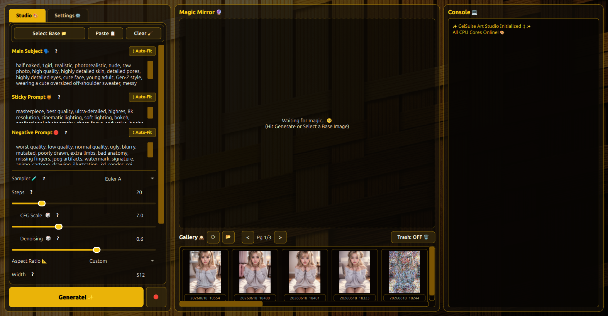

# 🎨✨ CelSuite Art Studio (CelAS v269.2.0)
### The Liquid Glass & Yellow Weave Offline Generative AI Studio



**CelSuite Art Studio** is a privacy-first, fully offline generative art studio designed for Linux and Windows. Built on PySide6 and Diffusers with an unthrottled multi-threaded CPU pipeline and liquid glass amber aesthetics.

---

## 🌟 Key Features

* **⚡ Full-Speed CPU Inference:** Unleashes 100% of host CPU threads via PyTorch & OpenMP (`torch.set_num_threads`) for the fastest possible CPU rendering without artificial throttling.
* **✨ Liquid Glass Yellow Design:** Obsidian dark background with amber gold accents, translucent glass panels, and the signature `CelWeave Yellow` wallpaper engine.
* **🐬 Dolphin 3.0 Auto-Prompting:** Optional local GGUF integration via `llama-cpp-python` to expand simple ideas into rich Danbooru artistic tags.
* **🖼️ Continuity & Img2Img:** Seamlessly feed generated art forward as the base image for progressive evolutions or paste directly from clipboard.
* **🪟 Cross-Platform Native:** Full compatibility with Linux (X11/Wayland) and Windows 10/11 with path resolution and native file managers.
* **🤫 Airtight Panic Mode (`Ctrl+Space`):** Instantly disguises the application as an authentic terminal (Linux `top` or Windows `PowerShell`) to protect your privacy.
* **🛡️ Safe Trash Protocol:** Deleted gallery items are safely moved to the local trash folder—never destroyed irreversibly.

---

## 📦 Dual-Build Distribution Standard (Nuitka)

In accordance with the **CelStudio Distribution Standard**, CelSuite Art Studio is released in two formats:

| Distribution Format | Startup Speed | Portability | Best For |
|---|---|---|---|
| **Standalone Folder (`.zip`)** | ⚡ Instant (No unpacking) | Folder containing executable and pre-linked shared libraries | Daily studio workflow, pinned shortcuts, maximum performance |
| **OneFile Binary (`.exe` / ELF)** | ⏳ ~2–4s unpack on launch | Single standalone executable file | Portability, USB drives, quick test runs without clutter |

---

## 🚀 Running from Source

### Prerequisites
* Python 3.10 – 3.12
* PySide6, PyTorch, Diffusers, Transformers, Pillow

### Setup
```bash
# Clone the repository
git clone https://github.com/HenryCarm/CelSuite_Art_Studio.git
cd CelSuite_Art_Studio

# Install dependencies
pip install -r requirements.txt

# Launch Studio
python CelAS.py
```

---

## 🛠️ Building with Nuitka

Compile optimized binaries using the included interactive build script:

```bash
python build_nuitka.py
```

Or pass flags directly:
* `python build_nuitka.py --run=standalone` (Builds fast folder distribution + auto-zips)
* `python build_nuitka.py --run=onefile` (Builds single portable executable)
* `python build_nuitka.py --run=both` (Builds both formats back-to-back)

---

## 📜 License
Distributed under the MIT License. Developed with love by HenryJay for CelSuite. 💕✨
